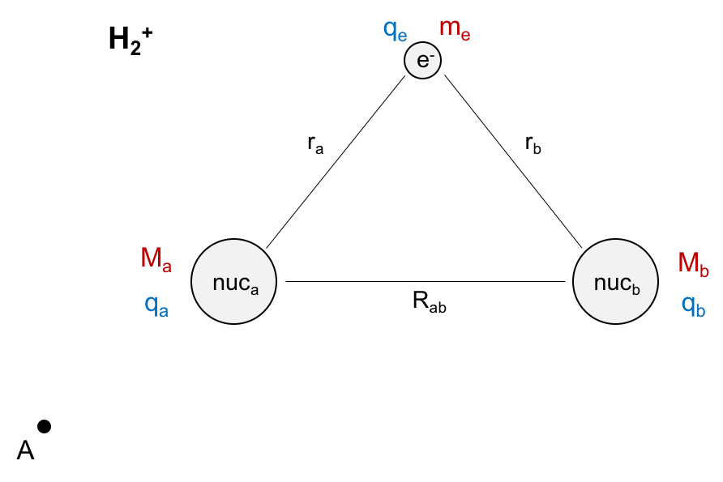



(For table of contents, visit [homepage](/README.md))

[Previous](.md)/[Next](.md)

# Chemical Bonding from Quantum Perspective

Up to this point, only systems with two particles have been solved with the Schrödinger equation. On the [Pertubation Theory](/perturb.md) page, $H_2^+$ was discussed and it was said that the wavefunctions could not be solved. This is because it is impossible to solve the Schrödinger equation for a system contianing more than two particles, which is known as the three body problem. Now we are going to examine the interactions more closely for the system using certain approximations. Below $H_2^+$ system is picutred:

There is kinetic and potential energy in the system. The kinetic energy is of the molecule moving through space from the origin (point A). And the potential energy in the system is interactions between the three bodies (nucleus-nucleus interaction and nucleus-electron interactions). Each of the particles have a charge of $q$ where the electron is negative and each of the nuclei are positive. There are attractive forces between the electron and each of the nuclei as well as repulsive forces between the nuclei. Therefore, in order to determine the energy of the system, these potetial energy forces need to be taken into account as well as the motion of the molecule through space. The Hamiltonian can be written as follows (where $\nabla = \frac {\partial}{\partial x}$):

$\hat H = (\frac {-\hbar^2}{2M_a} \nabla_a^2 + \frac {-\hbar^2}{2M_b} \nabla_b^2) + \frac {-\hbar^2}{2m_e} \nabla_e^2 + (-\frac {q^2}{4 \pi \epsilon_o r_a} - \frac {q^2}{4 \pi \epsilon_o r_b}) + \frac {q^2}{4 \pi \epsilon_o R_{ab}}$

This can then be rewritten as a sum of four different parts:

$\hat H = \hat T_{nuc} + \hat T_e^{-} + \hat V_{nuc-e^-} + \hat V_{nuc-nuc}$, 

where $\hat T_{nuc} = \frac {-\hbar^2}{2M_a} \nabla_a^2 + \frac {-\hbar^2}{2M_b} \nabla_b^2$, $\hat T_e^{-} = \frac {-\hbar^2}{2m_e} \nabla_e^2$, $\hat V_{nuc-e^-} = -\frac {q^2}{4 \pi \epsilon_o r_a} - \frac {q^2}{4 \pi \epsilon_o r_b}$, and $\hat V_{nuc-nuc}=\frac {q^2}{4 \pi \epsilon_o R_{ab}}$.

This Hamiltonian can then be "solved" to determine the total energy of the system: $\hat H \Psi = \xi \Psi$. 

This problem cannot be solved and so an approximation is needed in order to spearte the two components of the Hamiltonian: the nucleus and the electron. The [Born-Oppenheimer Approximation](/BO.md) can be used in order to solve this problem. More is discussed about the approximation and assumptions on the B-O Approximation page. 
